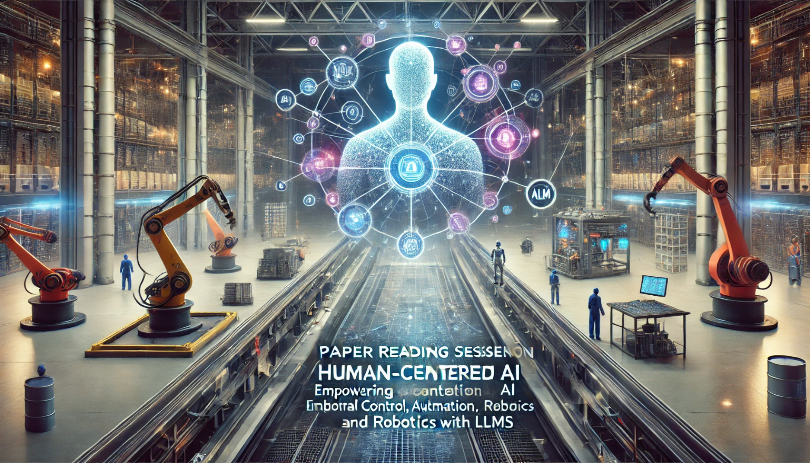

# **Title:** *Exploring Large Language Models for Enhanced Industrial Control and Automation*

---

**Overview:**

This paper reading synthesizes research on the application of large language models (LLMs) to enhance control, automation, and robotics within industrial settings. These studies illustrate how LLMs are being leveraged beyond traditional controllers, providing adaptability, flexibility, and configurability through natural language interfaces across a range of applications. Each paper explores unique methods of deploying LLMs in industrial environments, addressing automation, simulation, and modular production, while offering insights into how LLMs facilitate more intuitive human-machine interactions and decision-making processes.

   
  <em>This image was generated by OpenAI's DALL-E model.</em>

---

#### 1. **Pre-Trained Large Language Models for Industrial Control (Song et al.)**

   - **Objective:** To test the capabilities of LLMs, specifically GPT-4, in controlling HVAC systems, focusing on sample efficiency and adaptability.
   - **Methodology:** The HVAC control task is framed as a language game, where GPT-4 receives text-based prompts (e.g., task description, selected demonstrations, and current observations) and responds with control actions.
   - **Findings:** GPT-4’s performance approaches that of reinforcement learning (RL) models with fewer samples and minimal technical debt, underscoring the potential of using LLMs for direct control in industrial applications.
   - **Implications:** This study highlights LLMs’ potential as controllers in industrial systems, where adapting with minimal samples and setup time is essential.

---

#### 2. **Control Industrial Automation System with Large Language Models (Xia et al.)**

   - **Objective:** To integrate LLMs into an industrial automation framework, creating an end-to-end control system that’s more intuitive and adaptive than traditional automation setups.
   - **Framework Design:** 
      - **Agent System:** Custom LLM agents handle industrial tasks.
      - **Event-Driven Modeling:** Real-time data feeds the LLM for inference, enabling dynamic response to automation needs.
      - **Structured Prompting:** Provides a controlled input for better LLM interpretability.
   - **Contributions:** This framework facilitates real-time planning and task execution, allows for dataset creation for fine-tuning, and reduces the need for complex programming in industrial systems.
   - **Implications:** The system’s adaptability to spontaneous events paves the way for more human-intuitive operation and enhances human-machine interaction in industrial settings.

---

#### 3. **LLM Experiments with Simulation: Multi-Agent System for Digital Twin Parametrization (Xia et al.)**

   - **Objective:** To automate simulation model parametrization in digital twins using a multi-agent LLM system, facilitating a more dynamic and autonomous configuration process.
   - **Design Features:** LLM agents are assigned to observe, reason, and make decisions based on digital twin simulations, dynamically exploring and selecting viable parameters.
   - **Case Study & Validation:** Demonstrates successful parameter adjustments and reductions in cognitive load, aiding complex decision-making for users.
   - **Implications:** This approach improves the usability of digital twin models by infusing LLM-driven heuristics, potentially broadening digital twins' applicability in industrial optimization and simulation.

---

#### 4. **Towards Autonomous Systems: Modular Production with LLM-Enhanced Control (Xia et al.)**

   - **Objective:** To combine modular production systems, digital twins, and LLMs to enable intelligent task planning and flexible control in a smart factory environment.
   - **Framework Components:** 
      - **LLM-Agents:** Manage both high-level tasks and low-level functionalities, dynamically orchestrating modular production processes based on task instructions.
      - **Digital Twin Integration:** Digital twins document system capabilities, informing the LLM-agents in real-time.
   - **Outcomes:** LLM-agents effectively interpret production goals and autonomously manage operations without predefined instructions, showcasing adaptability in unplanned tasks.
   - **Implications:** This research underlines the potential for LLMs in smart manufacturing, where adaptable, efficient production systems are critical, while also pointing to challenges and limitations for future exploration.

---

#### 5. **ControlAgent: Automating Control System Design via Novel Integration of LLM Agents and Domain Expertise (Guo et al.)**

   - **Objective:** To automate control system design by integrating LLM agents with control theory expertise.
   - **Key Contributions:** ControlAgent encodes expert knowledge, performing iterative design refinement to meet user-defined stability and performance goals.
   - **Outcomes:** Demonstrated success in complex control tasks without human intervention, showing high efficacy in automation.
   - **Implications:** Highlights the potential for fully automated, end-to-end control system solutions that mimic human engineering processes.

---

#### 6. **Embodied Intelligence in Manufacturing: Leveraging LLMs for Autonomous Industrial Robotics**

   - **Objective:** To explore LLM-driven frameworks for industrial robotics, focusing on task design, decision-making, and execution.
   - **Framework Elements:** Task matching, autonomous tool path design, and embodied intelligence in robotics.
   - **Outcomes:** High success rates in manufacturing tasks, particularly in planning and 3D task challenges.
   - **Implications:** Shows potential for LLMs in autonomous robotics, especially with visual and real-time feedback to handle human constraints.

---

#### 7. **Language-Guided World Models: A Model-Based Approach to AI Control (Zhang et al.)**

   - **Objective:** To create language-guided world models that allow for flexible agent control through natural language.
   - **Core Concept:** Utilizing LLMs to generalize across tasks via compositional language descriptions.
   - **Results:** Enhanced model generalizability and improved agent control transparency and safety.
   - **Implications:** Promotes adaptable AI control with language-based interaction, broadening control applications.

---

#### 8. **ROS-LLM: A ROS Framework for Embodied AI with Task Feedback and Structured Reasoning**

   - **Objective:** To enable intuitive programming of robots via ROS and LLM-based prompts for task specification.
   - **Framework Features:** Task extraction, feedback-based learning, and behavior modeling (sequence, state machine, behavior tree).
   - **Results:** Robust scalability in various control tasks, validated through practical experimentation.
   - **Implications:** Supports non-expert users in robot programming, advancing LLM usability in long-term industrial tasks.

---

#### 9. **Lemur: Harmonizing Natural Language and Code for Language Agents**

   - **Objective:** To bridge the gap between natural language interaction and coding in language agents.
   - **Design Focus:** Balanced language and coding proficiency, optimized for text and code integration.
   - **Outcomes:** Lemur-Chat demonstrates exceptional performance in agent tasks requiring both human communication and tool usage.
   - **Implications:** Aids in creating language agents for control tasks, reinforcing coding and reasoning capabilities.

---

#### 10. **Code as Policies: Language Model Programs for Embodied Control**

   - **Objective:** To generate policy code for robotics based on natural language commands.
   - **Methodology:** Recursive code generation, using prompts to translate language into policy code for robots.
   - **Results:** Effective across various robotic platforms, enabling spatial and behavioral commonsense reasoning.
   - **Implications:** Provides a framework for policy development in robotics, enhancing automated responses.

---

#### 11. **ChatGPT for PLC/DCS Control Logic Generation (Koziolek et al.)**

   - **Objective:** To explore control logic generation for PLCs and DCS via ChatGPT and similar LLMs.
   - **Key Findings:** Demonstrates that ChatGPT can generate syntactically correct control code, assisting in productivity.
   - **Implications:** Highlights the potential of LLMs in control logic programming, paving the way for automated PLC and DCS code generation.

---

#### 12. **Capabilities of Large Language Models in Control Engineering (Kevian et al.)**

   - **Objective:** To benchmark LLM capabilities in control engineering problem-solving.
   - **Contributions:** ControlBench dataset for evaluating model effectiveness in control-related tasks.
   - **Implications:** Positions Claude 3 Opus as a leading LLM for control engineering, informing future development of LLM-based control tools.

---

#### 13. **LLM2Swarm: Robot Swarms that Responsively Reason, Plan, and Collaborate through LLMs**

   - **Objective:** To integrate LLMs with robot swarms for responsive planning and collaborative control.
   - **Approach:** Indirect integration (for pre-deployment validation) and direct integration (real-time collaboration).
   - **Results:** Proof-of-concept demonstrations show adaptability to unexpected scenarios without predefined responses.
   - **Implications:** Enhances collaborative swarm control in dynamic environments, crucial for autonomous response systems.

---

#### 14. **Fine-Tuning Language Models Using Formal Methods Feedback**

   - **Objective:** To automate LLM fine-tuning for domain-specific tasks in autonomous systems.
   - **Methodology:** Uses formal verification to guide iterative fine-tuning of controllers.
   - **Results:** Increased compliance with specifications in applications such as autonomous driving.
   - **Implications:** Shows promise in improving LLM reliability for control tasks where regulatory compliance is critical.

---

**Conclusion and Future Directions:**

These studies collectively emphasize LLMs' promise in transforming industrial control and automation through flexibility, sample efficiency, and natural language interfaces. Future work could refine these applications by addressing limitations, such as real-time responsiveness and robustness in highly dynamic environments. As LLMs become more efficient and accessible, their integration into diverse industrial tasks could drive the evolution of smarter, more intuitive automated systems across sectors.
